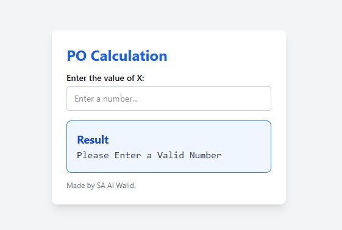
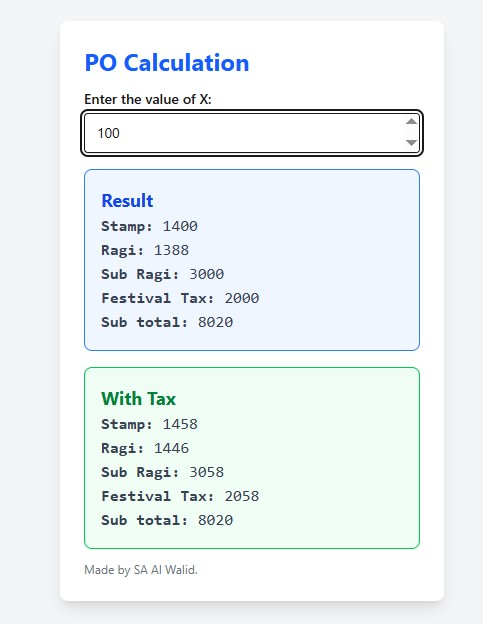

# 📱 Pay Order Calculator

A simple and efficient web application designed for use in Sub-Registrar Offices to calculate Pay Order amounts with and without tax.  
I work part-time at a Sub-Registrar Office, where manually calculating Pay Orders was time-consuming.  
To make the process faster and easier, I built this application.  
Built with **React**, **Tailwind CSS**, and powered as a **Progressive Web App (PWA)** for installation on mobile and desktop devices.

---

## ✨ Features

- 📥 **Installable PWA** (Progressive Web App)
- ⚡ **Instant Calculation** on input change
- 🧮 Calculates:
  - Stamp
  - Ragi
  - Sub Ragi
  - Festival Tax
  - Sub Total
- 📊 Shows both:
  - Without Tax
  - With Tax amounts
- 🎨 **Responsive** and **Modern UI** using Tailwind CSS
- 🔒 **Lightweight** and **Secure**

---

## 🚀 Technologies Used

- [React.js](https://react.dev/)
- [Vite](https://vitejs.dev/)
- [Tailwind CSS](https://tailwindcss.com/)
- [vite-plugin-pwa](https://vite-pwa-org.netlify.app/) (for PWA support)

---

## 📸 Screenshots

|                Calculator Input                 |                  Results Display                  |
| :---------------------------------------------: | :-----------------------------------------------: |
|  |  |

---

## 🔥 How to Run Locally

1. **Clone the repository**
   ```bash
   git clone https://github.com/Walid-3105/pay-order-calculator.git
   ```
